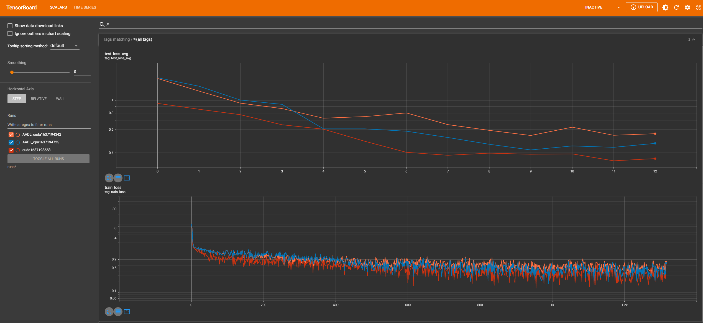

Minimal example

The model being used is not optimal for mnist, but was chosen because it shows a difference between AADL_gpu and AADL_cpu and also trains fast.

Environment:
  - Container image: nvcr.io/nvidia/pytorch:21.09-py3
  - CPU: AMD Threadripper 1900x
  - GPU: Nvidia Titan RTX

Results:
```
python3 main.py --AADL_gpu

[...]

Test set: Average loss: 0.4970, Accuracy: 8135/10000 (81%)
```
```
python3 main.py --AADL_cpu

[...]

Test set: Average loss: 0.3923, Accuracy: 8682/10000 (87%)
```

```
python3 main.py

[...]

Test set: Average loss: 0.3573, Accuracy: 8807/10000 (88%)
```


